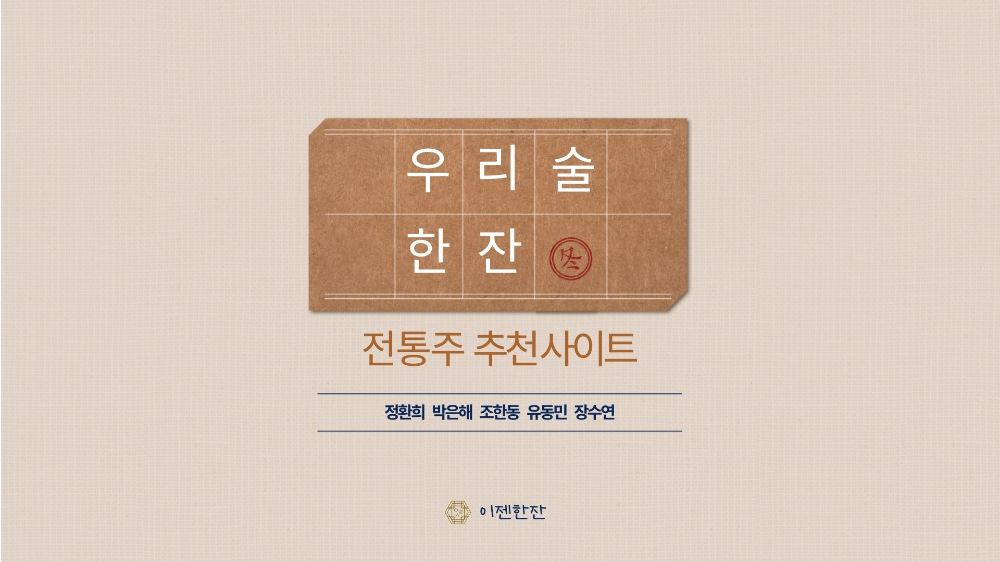
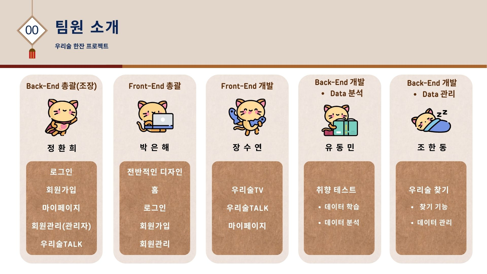
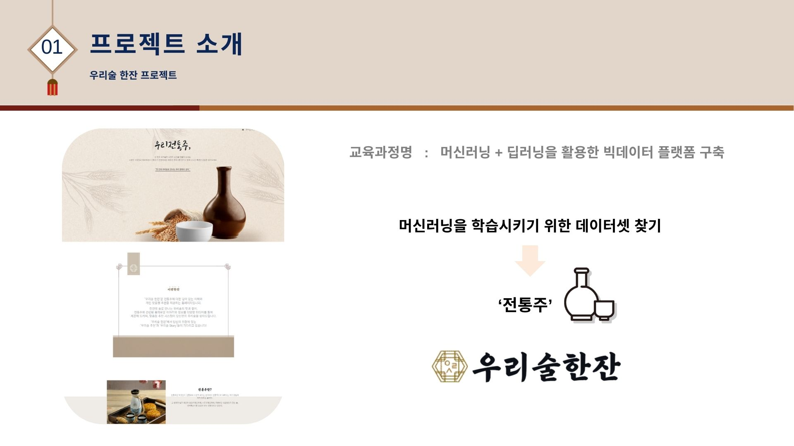
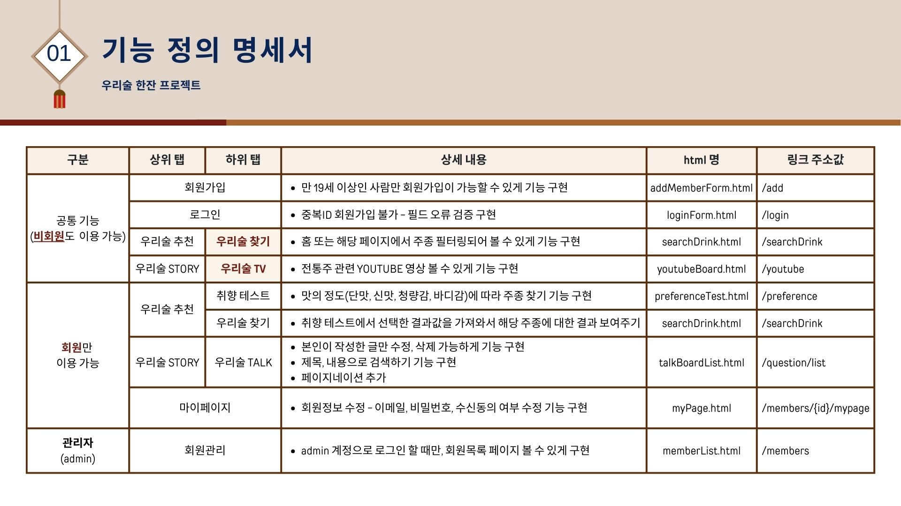

## 프로젝트 시연 영상

##### 홈 - pc버전
<video src="https://github.com/user-attachments/assets/ea302332-4735-47fe-906a-1222ce791bc4" width="700" height="370" autoplay muted></video>
  
##### 각 페이지의 header 통일성
<video src="https://github.com/user-attachments/assets/fdd3877c-7840-426b-b484-0467637cabe2
" width="700" height="370" autoplay muted></video>
  
## 관리자 페이지의 접근 제어

##### admin(관리자)로 로그인 시
<video src="https://github.com/user-attachments/assets/64312dc1-ed3b-4fce-aec2-514cfb31cca5
" width="700" height="370" autoplay muted>
  
##### 일반 사용자 혹은 비로그인 시
<video src="https://github.com/user-attachments/assets/3e049b40-a4c0-42a1-a9ea-bb0fb62f7c29" width="700" height="370" autoplay muted>
